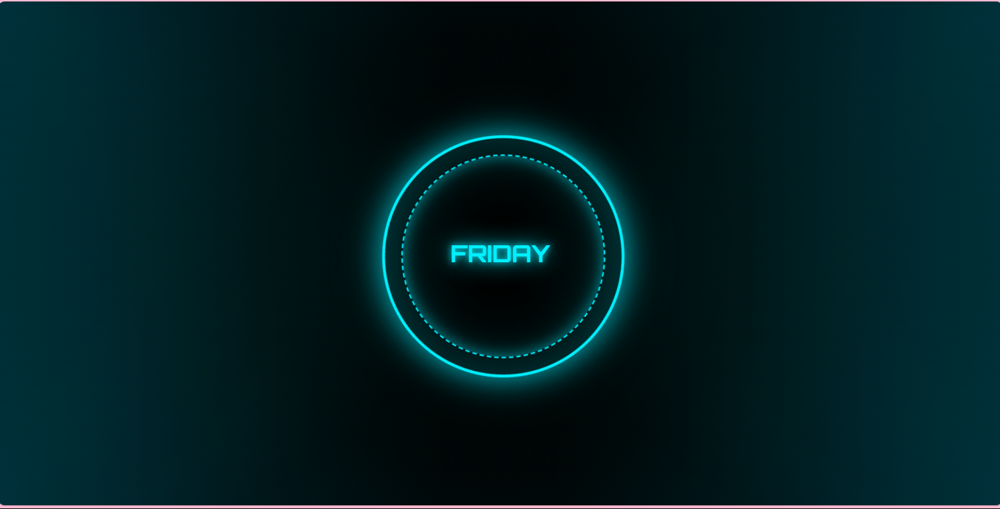

<h1 align="center">🤖 FRIDAY - Personal Voice Assistant</h1>

A Python-based AI Voice Assistant inspired by modern virtual assistants, capable of responding to voice commands, providing weather updates, playing music, reading news headlines, and opening websites through an interactive glowing orb interface.

<h2>🎯 Project Overview</h2>

FRIDAY is a lightweight Python voice assistant designed to perform everyday tasks through natural voice commands. The assistant listens for user instructions, processes voice input using speech recognition, and responds through text-to-speech.

The project also includes an interactive glowing orb interface inspired by modern AI assistants, creating a more engaging user experience.

<h2>🚀 Features</h2>

<ul>
<li>🔊 Voice Command Recognition</li>
<li>🗣️ Text-to-Speech Responses</li>
<li>🌦 Real-Time Weather Updates</li>
<li>📰 Latest News Headlines</li>
<li>🎵 Play Music from YouTube</li>
<li>🌐 Open Websites Through Voice Commands</li>
<li>🤖 Wake Word Activation ("Friday")</li>
<li>✨ Interactive Glowing Orb User Interface</li>
<li>🎙 Natural Language Voice Interaction</li>
</ul>

<h2>⚙️ Technologies Used</h2>

<table border="1" cellpadding="8">

<tr>
<th>Category</th>
<th>Technology</th>
</tr>

<tr>
<td>Programming Language</td>
<td>Python</td>
</tr>

<tr>
<td>Voice Recognition</td>
<td>SpeechRecognition</td>
</tr>

<tr>
<td>Text to Speech</td>
<td>pyttsx3</td>
</tr>

<tr>
<td>Frontend</td>
<td>HTML</td>
</tr>

<tr>
<td>Browser Automation</td>
<td>webbrowser</td>
</tr>

<tr>
<td>Media Playback</td>
<td>YouTube</td>
</tr>

</table>

<h2>📂 Project Structure</h2>

<pre>
FRIDAY-Personal-Assistant
│
├── src
│   ├── main.py
│   └── musiclibrary.py
│
├── templates
│   └── index.html
│
├── screenshot
│   └── Front.png
│
├── README.md
└── requirements.txt
</pre>

<h2>📁 File Description</h2>

<table border="1" cellpadding="8">

<tr>
<th>File</th>
<th>Description</th>
</tr>

<tr>
<td><code>src/main.py</code></td>
<td>Main assistant logic including speech recognition, command processing, and assistant responses.</td>
</tr>

<tr>
<td><code>src/musiclibrary.py</code></td>
<td>Stores music playlists and YouTube links used by FRIDAY.</td>
</tr>

<tr>
<td><code>templates/index.html</code></td>
<td>Glowing orb interface displayed during assistant interaction.</td>
</tr>

<tr>
<td><code>requirements.txt</code></td>
<td>Contains all required Python dependencies.</td>
</tr>

<tr>
<td><code>README.md</code></td>
<td>Project documentation and setup guide.</td>
</tr>

</table>

<h2>🔄 How It Works</h2>

<ol>
<li>User activates FRIDAY using voice commands.</li>
<li>SpeechRecognition converts speech into text.</li>
<li>The assistant analyzes the command.</li>
<li>Relevant action is executed.</li>
<li>FRIDAY responds using text-to-speech.</li>
<li>The glowing orb interface provides visual feedback.</li>
</ol>

<h2>🧠 Supported Commands</h2>

<ul>
<li>"Play music"</li>
<li>"Open YouTube"</li>
<li>"What's the weather?"</li>
<li>"Tell me the news"</li>
<li>"Open Google"</li>
<li>"Search on YouTube"</li>
<li>Custom playlist commands</li>
</ul>

<h2>📷 Project Screenshot</h2>

Glowing Orb Interface of FRIDAY Personal Voice Assistant

<h2>🌐 Live Demo</h2>

👉 <a href="https://harshitaarora0019.github.io/Friday-Personal-Assistant/">
<b>Open FRIDAY UI Live</b>
</a>

<h2>💡 Key Learning Outcomes</h2>

<ul>
<li>Voice Recognition Systems</li>
<li>Speech-to-Text Processing</li>
<li>Text-to-Speech Integration</li>
<li>Python Automation</li>
<li>Frontend and Backend Integration</li>
<li>User Interaction Design</li>
<li>AI Assistant Development Fundamentals</li>
</ul>

<h2>👩‍💻 Author</h2>

<b>Harshita Arora</b>

<b>🤖 Your Personal AI Assistant for Everyday Tasks</b>

